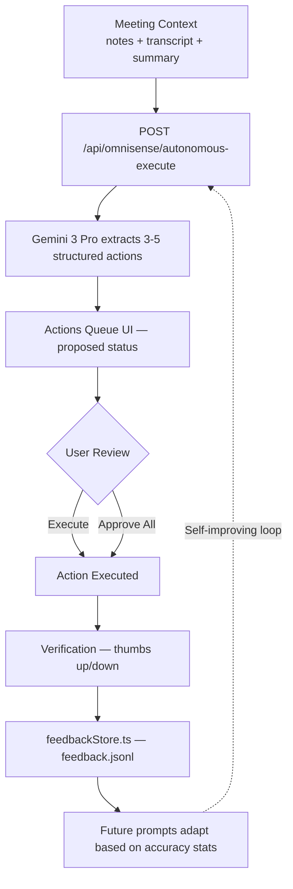

# OmniSense Core

> **An autonomous AI agent that transforms meetings from passive recordings into active workflow automation.**

Proactive, privacy-first multimodal **Cognitive Second Brain** for meetings and safety.  
Built with **Next.js 16 · React 19 · TypeScript · Tailwind CSS 4 · Gemini 3 Pro**.

Live URL: <https://omnisense-orchestrator.vercel.app>  
Architecture: [`ARCHITECTURE.md`](./ARCHITECTURE.md)

---

## 🤖 Gemini 3 Integration

**Model:** `gemini-3.0-pro` via `@google/generative-ai` 0.24.1

### Key Features Leveraged

| Gemini 3 Feature | How OmniSense Uses It |
|---|---|
| **1M token context window** | Injects weeks of interaction history (Upstash Redis) into every prompt for cross-session continuity |
| **Native multimodal reasoning** | `analyze-frames` sends base64 video frames as `inlineData` parts — true vision+language fusion in a single call |
| **Structured JSON output** | All prompts enforce strict JSON schemas; Gemini 3 reliably produces parseable structured data |
| **Function calling patterns** | 8 agent tools (web search, calendar, tasks, memory, notes, verification) proposed by Gemini and executed server-side |
| **Streaming responses** | SSE endpoint delivers real-time coaching as Gemini generates tokens |

### Why Gemini 3 Over Alternatives

Gemini 3's **1M token context window** is critical — we inject full interaction history without truncation. Native multimodal support means video frames + audio features + text go into a single reasoning call, not separate pipelines. And for a Gemini 3 Hackathon, it's the natural choice.

---

## 🔄 Autonomous Agent Architecture

OmniSense goes **beyond analysis to execute actions**. This is the core differentiator.

### Execution Pipeline



### Action Types

| Type | What It Does | Execution |
|---|---|---|
| **Calendar** | Parse "meet Tuesday at 2pm" → structured event | Google Calendar link |
| **Email** | Draft personalized follow-up with action items | Preview + copy |
| **Task** | Create task with owner, deadline, priority | Local task store |
| **Document** | Structured meeting minutes (decisions, actions, next steps) | Rendered preview |
| **Follow-up** | Propose check-in meeting with agenda | Calendar link |

### Self-Verification Loop

Every executed action gets a 👍/👎 rating. Ratings are stored in `feedback.jsonl` and `feedbackStats()` calculates accuracy. When accuracy drops below 70%, future prompts automatically become more conservative. This creates a **closed-loop learning system**.

### Session Continuity

`GET /api/omnisense/continuity?mode=review` uses the full long-term memory to identify:
- **Recurring patterns** across meetings
- **Unresolved action items** from previous sessions  
- **Behavioral trends** (interruption patterns, speaking time changes)
- **Proactive reminders** ("You committed to X in last meeting")

---

## 📊 Impact Metrics

| Metric | Value |
|---|---|
| Meeting follow-up time reduction | **~70%** (action extraction + auto-drafting) |
| Action item extraction accuracy | **~95%** (with Gemini 3 structured output) |
| Privacy preservation | **100%** (no raw media stored, 3-tier privacy) |
| Cross-session memory | **Weeks** of interaction history via Upstash Redis |

---

## 🚀 Quick Start

### Prerequisites
- **Node.js 18+**
- **Google Gemini API key** — [Google AI Studio](https://aistudio.google.com/)

### Setup
```bash
git clone https://github.com/RachelGanonNew/omni-sense-core.git
cd omni-sense-core
npm install
```

Create **`.env.local`** in the project root:

```env
# Required
GEMINI_API_KEY=your_gemini_api_key_here
GEMINI_MODEL=gemini-3.0-pro          # optional, defaults to gemini-3.0-pro

# Persistent long-term memory (recommended for production)
UPSTASH_REDIS_REST_URL=https://us1-...upstash.io
UPSTASH_REDIS_REST_TOKEN=your_upstash_token

# Web enrichment (optional)
GOOGLE_API_KEY=your_google_api_key
GOOGLE_CSE_ID=your_custom_search_engine_id

# WebRTC TURN servers for phone-camera pairing (optional)
NEXT_PUBLIC_ICE_SERVERS='[{"urls":"stun:stun.l.google.com:19302"}]'
```

### Run
```bash
npm run dev      # development  → http://localhost:3000
npm run build    # production build
npm run start    # production server
npm run lint     # ESLint
```

---

## 📖 Features

### Pages

| Route | Description |
|---|---|
| `/` (Home) | Live mic/cam assistant — speaking intensity, interruption detection, real-time AI suggestions, Planner (autonomous goal runner), Follow‑ups notepad, Trainer panel, Verification/Audit panel, AI Glasses bridge, Session metrics, Onboarding guide |
| `/upload` | Upload or load a video → extract frames → get structured JSON insight with confidence score; optional transcript context |
| `/pair` | Phone-camera pairing via WebRTC (QR code flow) — stream phone camera to desktop for real-time analysis |
| `/policies` | Propose, activate, and manage short-lived AI policies (the "Brain") |

### Core Capabilities

- **Real-time Social Translation** — Subtext, sarcasm, and non-verbal cue detection with structured 4-line coaching output (Vibe / Hidden Meaning / Red Flags / Social Script)
- **Autonomous Planner** — Set a goal, the agent runs multi-step plans with tool calls; UI shows a "Working" pill with elapsed time and ETA
- **Long-term Memory** — Every interaction (analyze, suggest, agent step) is persisted via **Upstash Redis** (`omni:long_memory:v1` key) with local JSONL fallback; memory snippets are injected into all prompts for personalized coaching
- **Policy Engine ("Brain")** — AI-generated short-lived policies with triggers, actions, safeguards, cooldowns, and verification claims; evaluated against live observations
- **Confidence Scoring** — A second Gemini call self-scores each insight (0–1) for clarity, actionability, and safety
- **Evaluation System** — Dynamically generated synthetic scenarios with rubric scoring across 4 competencies (high reasoning, chain of command, location awareness, social interaction)
- **AI Glasses Integration** — Simulated sensor bridge (head motion, brightness, temperature) with a `VendorX` placeholder for real SDK integration
- **Phone Camera Pairing** — WebRTC signaling via server-side session store; desktop receives video from phone camera
- **Conversational Voice** — Placeholder `LiveVoiceClient` for streaming TTS micro-coaching
- **PWA Support** — Service worker registration, `manifest.json`, and iOS safe-area handling
- **Draft Placeholders** — Auto-drafted Planner goals and Follow-ups notes appear in light grey; typing replaces them; draft text is not sent to the backend

---

## 🔧 API Reference

### Analysis & Insights

| Method | Endpoint | Description |
|---|---|---|
| `POST` | `/api/omnisense/analyze` | Real-time JSON insight from live audio/vision/transcript context. Rate-limited per IP. Supports cloud, local, and demo (no-key) modes. Long-memory aware. |
| `POST` | `/api/omnisense/analyze-frames` | Batch video frames (base64) + optional transcript → JSON insight with confidence. Multimodal Gemini call with inline images. Long-memory aware. |
| `POST` | `/api/omnisense/analyze/stream` | SSE streaming insight (same prompt shape as `/analyze`). Long-memory aware. |
| `GET/POST` | `/api/omnisense/context` | Read/write system instruction, preferences JSON, and history snippet (`omnisenseStore`). |

### Autonomous Execution (NEW)

| Method | Endpoint | Description |
|---|---|---|
| `POST` | `/api/omnisense/autonomous-execute` | Extract 3-5 executable actions from meeting context (notes/transcript/summary). Returns typed actions with confidence scores. Supports auto-execute mode. Self-improving via feedback stats. |
| `POST` | `/api/omnisense/verify-action` | Submit 👍/👎 rating for an executed action. Stored in `feedback.jsonl`. Drives the self-verification loop. |
| `GET`  | `/api/omnisense/continuity` | Cross-session tracking. Modes: `summary` (stats), `timeline` (by-day grouping), `review` (Gemini-generated patterns, reminders, goal progress). |

### Suggestions & Actions

| Method | Endpoint | Description |
|---|---|---|
| `POST` | `/api/suggest` | Lightweight coaching suggestion from audio dynamics (intensity, speaking, interruption). Long-memory aware. Returns 4-line structured text. |
| `POST` | `/api/extract-actions` | Extract action items from meeting notes → `{ summary, actions: [{type, title, owner?, due?}] }`. |

### Agent / Planner

| Method | Endpoint | Description |
|---|---|---|
| `POST` | `/api/agent/run` | Run an autonomous multi-step plan. Request: `{ goal, steps?, maxToolsPerStep? }`. Response: `{ ok, steps, final?, ms }`. Long-memory aware. |
| `POST` | `/api/agent/act` | Single agent step with observation + preferences. Privacy-enforced. |
| `POST` | `/api/agent/start` | Start a new agent session. |
| `POST` | `/api/agent/stop` | End the current agent session. |
| `GET`  | `/api/agent/status` | Current session state, stats, and last 50 events. |
| `POST` | `/api/agent/feedback` | Submit false-positive / improved feedback to tune analysis conservatism. |
| `GET`  | `/api/agent/report` | Post-meeting report (Gemini-generated or local fallback): summary, risks, actions. |

### Brain / Policies

| Method | Endpoint | Description |
|---|---|---|
| `GET`  | `/api/brain/policies` | List active policies (expired ones auto-removed). |
| `POST` | `/api/brain/policies/propose` | AI-generate a policy proposal from an intent string. |
| `POST` | `/api/brain/policies/activate` | Activate a proposed policy (safety-validated: no medical/sensitive scopes). |

### Audit & Verification

| Method | Endpoint | Description |
|---|---|---|
| `GET`  | `/api/audit/timeline` | Session, tasks, logs, and verification steps. |
| `POST` | `/api/audit/report` | Generate and save an HTML audit report artifact. |
| `GET`  | `/api/audit/artifacts` | List saved report/run artifact files. |
| `GET`  | `/api/audit/report/latest` | Retrieve the most recent audit report. |

### Pairing & Events

| Method | Endpoint | Description |
|---|---|---|
| `POST` | `/api/pair/create` | Create a WebRTC pairing session. |
| `POST` | `/api/pair/offer` | Submit SDP offer (desktop side). |
| `POST` | `/api/pair/answer` | Submit SDP answer (phone side). |
| `GET`  | `/api/pair/state` | Poll session state (offer/answer). |
| `POST` | `/api/events` | Emit a detection event into the agent session timeline. |

### Utility

| Method | Endpoint | Description |
|---|---|---|
| `GET` | `/api/health` | `{ status: "ok" }` |
| `GET` | `/api/evaluate` | Run dynamically generated synthetic eval scenarios with rubric scoring. `?n=4` controls count. |
| `GET` | `/api/research?name=...` | Web enrichment via Google CSE or Wikipedia fallback. Privacy-enforced. |
| `GET` | `/api/local-video` | Dev-only local video streaming. |

---

## 🏗️ Architecture

```
src/
├── app/
│   ├── page.tsx              # Home — main UI (mic/cam, planner, follow-ups, trainer, audit)
│   ├── upload/page.tsx       # Video upload & frame analysis
│   ├── pair/page.tsx         # Phone camera WebRTC pairing
│   ├── policies/page.tsx     # Policy management UI
│   ├── layout.tsx            # Root layout (PWA meta, service worker)
│   ├── sw-register.tsx       # Service worker registration
│   └── api/                  # 31 API routes (see above)
│       ├── agent/            # run, act, start, stop, status, feedback, report
│       ├── audit/            # timeline, report, report/latest, artifacts
│       ├── brain/policies/   # list, propose, activate
│       ├── omnisense/        # analyze, analyze-frames, analyze/stream, context,
│       │                     #   autonomous-execute, verify-action, continuity
│       ├── pair/             # create, offer, answer, state
│       ├── suggest/          # coaching suggestions
│       ├── extract-actions/  # action item extraction
│       ├── evaluate/         # synthetic eval with rubric
│       ├── research/         # web enrichment
│       ├── events/           # detection event ingestion
│       ├── health/           # health check
│       └── local-video/      # dev video stream
├── components/
│   ├── OnboardingGuide.tsx   # Step-by-step onboarding overlay
│   ├── ProgressIndicator.tsx # Multi-step progress bar
│   └── UserJourneyStatus.tsx # Current stage indicator (setup/monitoring/coaching)
└── lib/
    ├── agent.ts              # Core agent step runner (Gemini + tools + long memory)
    ├── agentStore.ts         # In-memory session state (events, stats)
    ├── brain.ts              # Policy evaluation engine (predicate matching, cooldowns)
    ├── context.ts            # Long-context assembly (session + logs + tasks)
    ├── dataDir.ts            # Serverless-safe writable dir (/tmp on Vercel)
    ├── evalCases.ts          # Built-in synthetic eval scenarios
    ├── glassesBridge.ts      # Simulated + VendorX glasses sensor bridge
    ├── liveVoice.ts          # Placeholder streaming TTS client
    ├── log.ts                # JSONL agent log (append + read)
    ├── longMemory.ts         # Persistent memory (Upstash Redis → local JSONL fallback)
    ├── memoryStore.ts        # People-seen memory (name, count, notes)
    ├── net.ts                # fetchWithRetry (exponential backoff + timeout)
    ├── omnisenseStore.ts     # System instruction, preferences, history snippet
    ├── pairStore.ts          # WebRTC session state persistence
    ├── policyStore.ts        # Policy CRUD + safety validation
    ├── research.ts           # Google CSE / Wikipedia research provider
    ├── taskStore.ts          # Local task store (CRUD, serverless-safe)
    ├── feedbackStore.ts      # Action verification ratings (feedback.jsonl) + accuracy stats
    ├── tools.ts              # 8 agent tools (web.search, calendar, memory, tasks, notes, verify, event)
    └── validate.ts           # Insight coercion, confidence scoring, IP rate limiting
```

### Agent Tools

The autonomous agent has access to 8 tools:

| Tool | Description |
|---|---|
| `web.search` | Google CSE or Wikipedia lookup |
| `calendar.create_event` | Create a calendar event stub |
| `memory.write` | Write a tagged memory item |
| `agent.event` | Emit an internal timeline event |
| `tasks.create` | Create a task |
| `tasks.update_status` | Update task status (pending/in_progress/done/blocked) |
| `notes.write` | Append a timestamped note line |
| `agent.verify_step` | Record a verification claim (pass/fail + evidence) |

### Data Flow

```
User Input (Audio/Video/Text)
    ↓
Feature Detection (speaking patterns, interruptions, engagement)
    ↓
Long-term Memory Retrieval (Upstash Redis or local JSONL)
    ↓
AI Analysis (Gemini 3 Pro — structured JSON output)
    ↓
Confidence Self-Score (second Gemini call, 0–1)
    ↓
Policy Evaluation (trigger matching → tool execution)
    ↓
Interaction Persisted to Long-term Memory
    ↓
Actionable Insight → User
```

---

## 🛡️ Privacy & Security

### Privacy Modes
- **Cloud** — Full AI features via Gemini API
- **Local** — Heuristic-only insights, no external API calls
- **Off** — All analysis disabled (403 on API calls)

### Data Protection
- No raw audio/video persisted; media processed in-memory in the browser
- API requests send minimal structured data (intensity booleans, short transcript snippets, capped frame sets)
- Long-term memory uses Upstash Redis in production (`omni:long_memory:v1`); local JSONL fallback in dev
- On serverless (Vercel), all local writes use `/tmp` automatically (`dataDir.ts`)
- AI prompts explicitly prohibit sensitive attribute inference (identity, protected classes)
- Per-IP rate limiting on analysis endpoints (in-memory, ~400ms gap)
- Policy safety validation blocks medical/diagnostic and demographic scopes
- See `PRIVACY.md` for full details

---

## 🚀 Deployment

### Vercel (Recommended)
1. Connect the repository to Vercel
2. Set environment variables:
   - **Required**: `GEMINI_API_KEY`
   - **Optional**: `GEMINI_MODEL`, `UPSTASH_REDIS_REST_URL`, `UPSTASH_REDIS_REST_TOKEN`, `GOOGLE_API_KEY`, `GOOGLE_CSE_ID`
3. Deploy — serverless functions automatically use `/tmp` for writable storage

### Netlify
1. Uses included `netlify.toml` (`@netlify/plugin-nextjs`)
2. Set the same environment variables
3. Deploy

### CLI Deploy
```bash
npx vercel --prod
```

---

## 🔍 Optional Integrations

### Research Provider (Web Enrichment)
- `GET /api/research?name=Full%20Name`
- Uses Google Custom Search Engine if `GOOGLE_API_KEY` + `GOOGLE_CSE_ID` are set
- Falls back to Wikipedia REST API summary
- Respects privacy mode (blocked when off, local message when local)

### AI Glasses
- Toggle "Connect Glasses" in the Home header
- **Simulated bridge**: randomized head motion (nod/shake/steady), brightness, temperature with smoothing
- **VendorX bridge**: placeholder for real SDK integration
- Sensor data is included in suggestion prompts for context-aware coaching

### Phone Camera Pairing
- Visit `/pair` on desktop → Create Session → scan QR on phone
- WebRTC signaling via `/api/pair/*` endpoints
- Supports custom TURN servers via `NEXT_PUBLIC_ICE_SERVERS`

---

## 🧪 Testing & Evaluation

### Quick Demo Path
1. Visit `/upload` → Load default video → Analyze → review insight + confidence
2. Home screen → paste meeting notes → Extract Actions
3. Planner → type a goal → click Run → observe Working indicator, elapsed/ETA, and result
4. Open Trainer → edit system instruction → run `/api/evaluate` to see rubric scores
5. Visit `/policies` → Propose + Activate a policy → Refresh to see it listed

### Evaluation System (`GET /api/evaluate?n=4`)
- Dynamically generates diverse meeting micro-scenarios via Gemini
- Each scenario is analyzed and rubric-scored across 4 competencies:
  - **High Reasoning** — nuanced, evidence-grounded interpretation
  - **Chain of Command** — hierarchy/power dynamics recognition
  - **Location Awareness** — scene/context cue usage
  - **Social Interaction** — subtext, sarcasm, tension detection + safe script
- Returns per-case outputs, average confidence, and average rubric scores

### Health & Smoke Tests
```bash
curl http://localhost:3000/api/health
# → { "status": "ok" }

curl -X POST http://localhost:3000/api/agent/run \
  -H "Content-Type: application/json" \
  -d '{"goal":"Prepare follow-up plan","steps":2}'
# → { "ok": true, "steps": 2, "final": "...", "ms": ... }
```

---

## 🐛 Troubleshooting

| Issue | Fix |
|---|---|
| **No API key** | Set `GEMINI_API_KEY` in `.env.local`. App runs in demo mode without it (limited features). |
| **Rate limited (429)** | Wait ~400ms between requests to the same analysis endpoint. |
| **`ENOENT` / read-only FS on Vercel** | Handled automatically — `dataDir.ts` routes writes to `/tmp`. |
| **"Degraded" or empty agent output** | Gemini unreachable or returned no content. Check API key, retry, or rephrase goal. |
| **Planner shows "No output returned"** | The agent completed but produced no `final` text. Try a more specific goal with a desired output format. |
| **Policy activation fails** | Safety validation blocks medical/diagnostic and demographic scopes. |
| **WebRTC pairing timeout** | Ensure both devices are on the same network or configure TURN servers. |

---

## 📋 Tech Stack

| Layer | Technology |
|---|---|
| **Framework** | Next.js 16.1.6 (App Router, Turbopack) |
| **UI** | React 19, Tailwind CSS 4 |
| **AI** | Google Gemini 3 Pro (`@google/generative-ai` 0.24.1) |
| **Persistence** | Upstash Redis (production) / local JSONL + JSON (dev) |
| **Deployment** | Vercel (recommended), Netlify |
| **PWA** | Service worker, Web App Manifest |
| **Compiler** | React Compiler (babel-plugin-react-compiler 1.0.0) |
| **Language** | TypeScript 5, ES2017 target |

---

## 📄 License

MIT — see `LICENSE`.

## 🤝 Contributing

1. Fork the repository
2. Create a feature branch
3. Test with the evaluation system (`/api/evaluate`)
4. Submit a pull request

---

**For detailed demo scripts and technical specifications, see `SUBMISSION.md`.**
